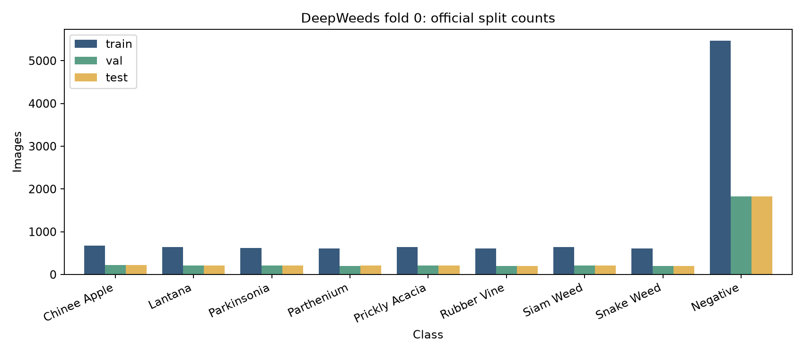
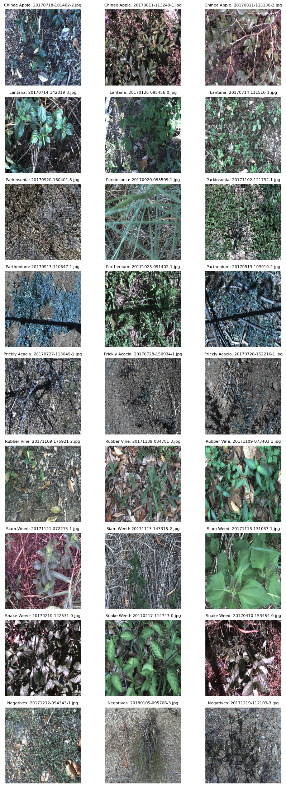
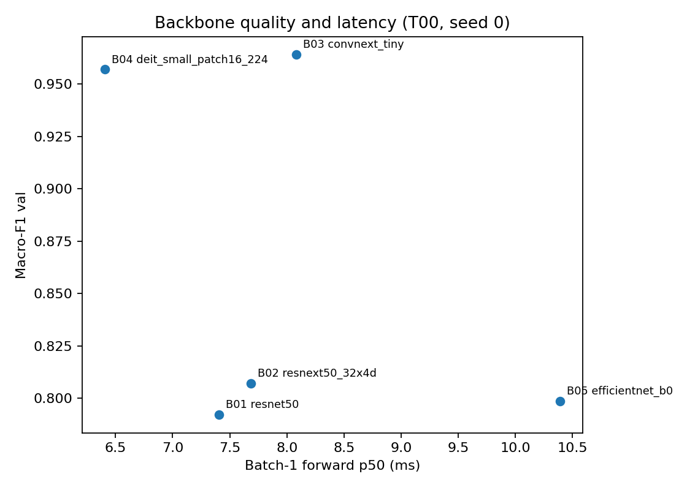
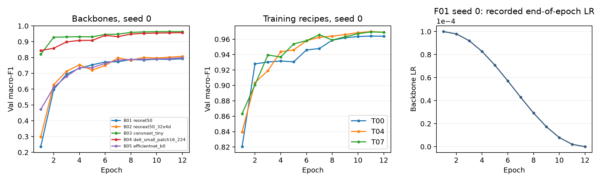
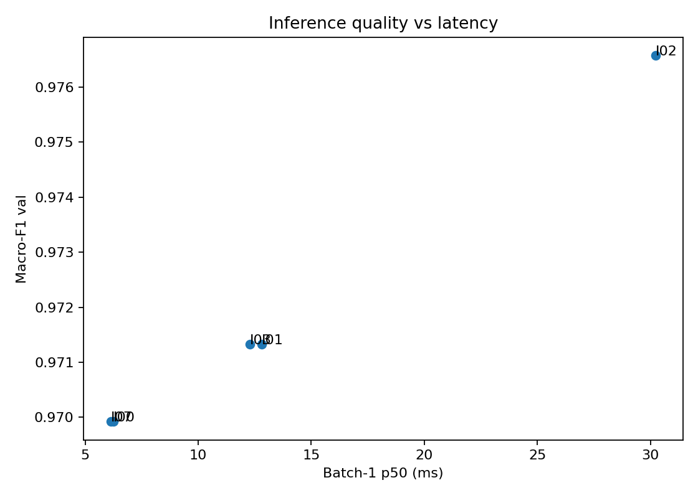
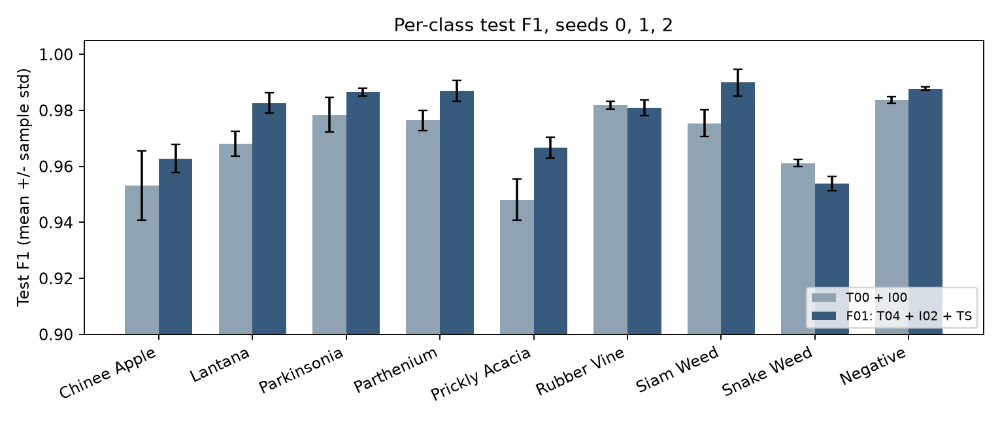
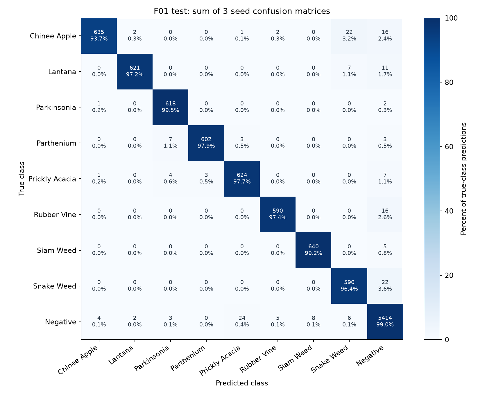

# DeepWeeds — So sánh mô hình, huấn luyện và suy luận

**Sinh viên:** Tống Trần Tiến Dũng — **MSSV:** 2A202602791  
**Notebook Kaggle:** https://www.kaggle.com/code/dung3te/notebook1167a23f8c  
**Nguồn số liệu:** output Kaggle đã hoàn tất, `results.xlsx`, CSV trong `predictions/` và log trong `runs/`.

## 1. Tóm tắt

Phân loại ảnh DeepWeeds thành 9 lớp trên fold 0 chính thức. Đã so sánh 5 backbone, 3 trục huấn luyện với 8 cấu hình và 5 cách suy luận. Chọn ConvNeXt-Tiny + CutMix + TTA 5 crop + temperature scaling dựa trên val. Chung kết dùng seed 0, 1, 2, cùng seed với mốc T00 + một view. Macro-F1 test đạt **0.9776 ± 0.0002**, top-1 **0.9822 ± 0.0002**. Macro-F1 tăng **+0.0080**, tương đương **0.80 điểm phần trăm**. ECE test giảm từ 0.0071 xuống 0.0043 sau hiệu chuẩn. I02 đo được p95 batch 1 là 31.30 ms trên Tesla T4, đáp ứng ngân sách GPU 100 ms. Kết luận chỉ áp dụng cho fold và điều kiện đo này.

## 2. Dữ liệu và thiết lập

### 2.1. Fold và EDA

Kiểm tra đã lưu trong `runs/F01/seed0/split_check.json`: train **10,501**, val **3,501**, test **3,507** ảnh, tương ứng 59.97% / 20.00% / 20.03%. Ba giao theo Filename đều bằng 0. Hợp chứa **17,509** ảnh và không thiếu ảnh tại thời điểm chạy Kaggle. Các CSV giữ cách chia chính thức. Không gộp val vào train. Val dùng chọn cấu hình, checkpoint và nhiệt độ; test dùng báo cáo sau khi lưu `final_selection.json`.

| Label | Lớp | Train | Val | Test | Tổng |
|---|---|---|---|---|---|
| 0 | Chinee Apple | 675 | 225 | 226 | 1126 |
| 1 | Lantana | 637 | 213 | 213 | 1063 |
| 2 | Parkinsonia | 618 | 206 | 207 | 1031 |
| 3 | Parthenium | 613 | 204 | 205 | 1022 |
| 4 | Prickly Acacia | 637 | 212 | 213 | 1062 |
| 5 | Rubber Vine | 605 | 202 | 202 | 1009 |
| 6 | Siam Weed | 644 | 215 | 215 | 1074 |
| 7 | Snake Weed | 609 | 203 | 204 | 1016 |
| 8 | Negative | 5463 | 1821 | 1822 | 9106 |

Negative có 9,106 ảnh, chiếm 52.01% toàn bộ dữ liệu. Lớp ít nhất là Rubber Vine với 1,009 ảnh. Tỉ lệ nhiều nhất/ít nhất **9.02** cho thấy mất cân bằng rõ. Macro-F1 là chỉ số chọn chính vì cho mỗi lớp trọng số bằng nhau. Chỉ số top-1 có thể bị lớp Negative chi phối. EDA thu được 1,126 ảnh Chinee Apple; đây là số đếm từ CSV, không thay bằng khoảng tham khảo 1,009–1,125 trong hướng dẫn.

Notebook đã hiển thị 3 ảnh train mỗi lớp. Ảnh có nền đất, lá khô, bóng đổ, cành đan xen và cây chiếm diện tích khác nhau. Parkinsonia và Prickly Acacia có trường hợp phần cây mảnh, khó tách khỏi nền. Các mẫu Negative vẫn có nhiều thực vật, nên không thể xem lớp này đơn giản là ảnh không có cây. Các mẫu này hỗ trợ giả thuyết cần đặc trưng hình thái và ngữ cảnh; chúng không đủ chứng minh nguyên nhân của từng lỗi test.

Mẫu 100 ảnh train cố định đều có kích thước 256 × 256 và 3 kênh. Pipeline chuyển RGB, dùng chuẩn hóa ImageNet mean (0.485, 0.456, 0.406), std (0.229, 0.224, 0.225). Không tính thống kê chuẩn hóa từ test.

### 2.2. Công thức T00 và kiểm tra pipeline

T00 thay head 9 lớp và fine-tune toàn mạng. Train: RandomResizedCrop 224, scale 0.8–1.0, horizontal flip xác suất 0.5. Val/test: resize cạnh ngắn 256 rồi center crop 224. AdamW, LR backbone 1e-4 và head 1e-3, weight decay 0.05. Norm/bias backbone không có weight decay. Warmup 1 epoch, sau đó cosine theo iteration. Mọi thử nghiệm dùng 12 epoch, batch 64, AMP và 2 worker. Chọn checkpoint có macro-F1 val cao nhất bằng `eval.compute_metrics` của repo gốc.

Môi trường Kaggle ghi trong `environment.json`: **Python 3.13.15, PyTorch 2.11.0+cu128, torchvision 0.26.0+cu128, timm 1.0.29, GPU Tesla T4**. Cố định random, NumPy, torch và seed worker. Log không ghi phiên bản scikit-learn/Pillow, nên không suy đoán các phiên bản này.

Smoke check trên train cho CE ban đầu **2.2180**, gần ln(9) = 2.1972. Tiny batch đạt train loss **0.0410 sau 11 bước**; eval loss cùng batch còn **0.8578**, cho thấy kiểm tra chưa chứng minh loss gần 0 ở eval khi BatchNorm mới được cập nhật ít bước. Notebook có ảnh sau augmentation đã hoàn nguyên chuẩn hóa, tên file và nhãn đi kèm. Trạng thái train/eval được in trong output. Đây là bằng chứng chạy pipeline, không phải phép đo khả năng tổng quát hóa.

## 3. So sánh backbone

Giữ T00, seed 0 và fold 0 cho cả 5 backbone. Số tham số được đếm sau khi thay head 9 lớp. GMAC do THOP đếm ở 224 × 224; cách đếm có thể bỏ sót một số toán tử và không thay thế đo độ trễ. Thời gian train/epoch dưới đây là trung bình phần train, chưa gồm val. Độ trễ backbone là batch 1, AMP, không gồm đọc ảnh/tiền xử lý.

| ID | Backbone | Params (M) | GMAC | F1 val | Top-1 val | Epoch tốt nhất | Train s/epoch | p50 ms |
|---|---|---|---|---|---|---|---|---|
| B01 | resnet50 | 23.5265 | 4.1317 | 0.7920 | 0.8526 | 12 | 54.3662 | 7.4037 |
| B02 | resnext50_32x4d | 22.9983 | 4.2862 | 0.8071 | 0.8495 | 12 | 63.3555 | 7.6849 |
| B03 | convnext_tiny | 27.8270 | 4.4548 | 0.9641 | 0.9720 | 11 | 54.4437 | 8.0838 |
| B04 | deit_small_patch16_224 | 21.6691 | 4.2408 | 0.9570 | 0.9680 | 12 | 36.8000 | 6.4077 |
| B05 | efficientnet_b0 | 4.0191 | 0.3846 | 0.7986 | 0.8520 | 12 | 30.4683 | 10.3915 |

ConvNeXt-Tiny có macro-F1 val cao nhất 0.9641. DeiT-Small đạt 0.9570 và p50 thấp hơn, 6.41 ms so với 8.08 ms, nên là ứng viên cân bằng tốc độ và F1. Chọn ConvNeXt cho Bước 2–3 vì mục tiêu chính là macro-F1; lựa chọn này được thực hiện trước test. EfficientNet-B0 ít tham số và GMAC nhất nhưng p50 lại 10.39 ms. Kết quả cho thấy GMAC thấp không bảo đảm latency batch 1 thấp trên phần cứng này.

ConvNeXt và DeiT đạt macro-F1 khoảng 0.82–0.84 ngay epoch 1; ResNet/ResNeXt chỉ khoảng 0.24–0.30. ConvNeXt có checkpoint tốt nhất epoch 11. Các backbone còn lại tốt nhất ở epoch 12, nên chưa đủ bằng chứng đã hội tụ hoàn toàn trong cùng ngân sách. ResNet/ResNeXt/EfficientNet có train loss cuối thấp nhưng val loss khoảng 0.44–0.48; với các mô hình này có dấu hiệu khoảng cách train/val lớn hơn. Không kết luận chúng luôn kém trên DeepWeeds nếu đổi công thức hoặc tăng thời gian.

| ID | Tag trọng số đã dùng |
|---|---|
| B01 | timm/resnet50.a1_in1k |
| B02 | timm/resnext50_32x4d.a1h_in1k |
| B03 | timm/convnext_tiny.in12k_ft_in1k |
| B04 | timm/deit_small_patch16_224.fb_in1k |
| B05 | timm/efficientnet_b0.ra_in1k |

Tag khởi tạo là một giới hạn của so sánh: ConvNeXt dùng `in12k_ft_in1k`, còn các mô hình khác dùng các bộ trọng số in1k với công thức tiền huấn luyện khác nhau. Bảng đo hiệu quả của **kiến trúc kèm bộ trọng số** trong T00; không thể quy toàn bộ chênh lệch cho kiến trúc. Mỗi backbone mới chạy một seed nên các chênh lệch nhỏ chưa phân biệt được nhiễu.

## 4. So sánh công thức huấn luyện

Chạy 3 trục A (khởi tạo), B (augmentation) và C (loss). T01–T06 mỗi cấu hình thay đúng một yếu tố so với T00. T07 là thí nghiệm kết hợp CutMix và label smoothing sau khi thử riêng. Giữ cùng seed 0, số epoch, split, backbone và công thức tối ưu.

| ID | Trục | Thay đổi | F1 val | Δ so với T00 | F1 Chinee | F1 Snake |
|---|---|---|---|---|---|---|
| T00 | baseline | T00: fine-tune, crop + flip, CE | 0.9641 | 0.0000 | 0.9252 | 0.9193 |
| T01 | A_init | Đóng băng backbone, chỉ train head | 0.8512 | -0.1129 | 0.8165 | 0.7677 |
| T02 | A_init | Khởi tạo ngẫu nhiên toàn mạng | 0.3386 | -0.6255 | 0.2200 | 0.3439 |
| T03 | B_aug | Thêm ColorJitter | 0.9580 | -0.0060 | 0.9155 | 0.9185 |
| T04 | B_aug | Thêm CutMix, alpha = 1 | 0.9699 | 0.0058 | 0.9374 | 0.9242 |
| T05 | C_loss | CE + label smoothing 0.1 | 0.9658 | 0.0017 | 0.9256 | 0.9200 |
| T06 | C_loss | Focal loss, gamma = 2 | 0.9607 | -0.0034 | 0.9263 | 0.9144 |
| T07 | B_plus_C | CutMix + label smoothing 0.1 | 0.9694 | 0.0054 | 0.9349 | 0.9249 |

Fine-tune tốt hơn frozen **0.1129 F1** và scratch **0.6255 F1** trong 12 epoch. Backbone tiền huấn luyện giúp rõ trong ngân sách hiện tại; chỉ train head chưa đủ. Scratch đạt checkpoint tốt nhất epoch 8 với F1 0.3386, không theo kịp fine-tune. Kết quả này không chứng minh scratch sẽ luôn kém nếu dùng ngân sách và công thức khác.

CutMix cải thiện **0.0058**, đưa F1 Chinee từ 0.9252 lên 0.9374 và F1 Snake từ 0.9193 lên 0.9242. ColorJitter làm F1 giảm 0.0060 trong lần chạy này. Focal gamma 2 giảm 0.0034, còn label smoothing tăng nhẹ 0.0017. Các chênh lệch này mới có một seed, chưa có std riêng cho từng ablation; không dùng std chung kết làm kiểm định cho từng thử nghiệm.

T07 đạt 0.9694, thấp hơn T04 chỉ 0.0005. Chưa phân biệt được hai công thức với một seed, và chưa thấy lợi ích cộng thêm rõ của smoothing khi đã có CutMix. Chọn **T04** vì có F1 val cao nhất và ít thành phần hơn T07. Không thực hiện tìm kiếm tham lam đổi mốc T00 giữa các ablation. EMA, sampler cân bằng, loss có trọng số lớp và thay LR chưa nằm trong các thử nghiệm đã chạy.

Mỗi lần train có biểu đồ riêng `curves/<exp_id>_<backbone>_seed<k>.png`, gồm train/val loss và macro-F1 val. Biểu đồ LR bổ sung dùng giá trị cuối mỗi epoch trong log; phần warmup bên trong epoch 1 không hiện đầy đủ. Loss train của CutMix/smoothing có nhãn mềm nên không so trực tiếp giá trị tuyệt đối với CE nhãn cứng để kết luận mô hình tốt hơn.

## 5. Suy luận, hiệu chuẩn và độ trễ

### 5.1. So sánh trên cùng checkpoint T04 seed 0

I00: một view. I01: gốc + lật ngang, trung bình xác suất. I02: 5 crop gồm bốn góc và tâm, crop 192 từ tensor 224 đã center crop/chuẩn hóa, resize bilinear về 224, trung bình xác suất. I03: hai view lật ngang nhưng trung bình logit rồi softmax. I07: I00 + temperature scaling, T = 1.0081 khớp trên val. Vì I02 dùng tensor đã center crop, nó không tương đương five-crop toàn ảnh gốc 256.

| ID | K | F1 val | Top-1 val | ECE val | p50 ms | p95 ms | p99 ms | Chi phí/p50 I00 |
|---|---|---|---|---|---|---|---|---|
| I00 | 1 | 0.9699 | 0.9771 | 0.0043 | 6.2513 | 9.4199 | 9.4514 | 1.0000 |
| I01 | 2 | 0.9713 | 0.9783 | 0.0047 | 12.8038 | 13.6328 | 13.6993 | 2.0482 |
| I02 | 5 | 0.9766 | 0.9817 | 0.0067 | 30.2341 | 31.2999 | 32.0487 | 4.8365 |
| I03 | 2 | 0.9713 | 0.9783 | 0.0046 | 12.2817 | 13.3702 | 13.8776 | 1.9647 |
| I07 | 1 | 0.9699 | 0.9771 | 0.0039 | 6.1404 | 6.4655 | 7.0979 | 0.9823 |

I02 tăng **0.0067 F1 val** so với I00, đổi lại p50 tăng **4.84 lần** và throughput batch 1 giảm từ 159.97 xuống 33.08 ảnh/s. I01 và I03 có F1/top-1 bằng nhau đến độ chính xác báo cáo, ECE khác nhẹ. Chưa có bằng chứng phương pháp gộp logit tốt hơn gộp xác suất. I07 giữ nguyên nhãn dự đoán và cải thiện ECE từ 0.0043 xuống 0.0039. p50 I07 nhỏ hơn I00 là dao động phép đo; không kết luận temperature scaling làm mô hình chạy nhanh hơn.

### 5.2. Quy trình đo

Dùng `model.eval()`, inference mode, tensor GPU batch 1 và batch 16 ở 224 × 224. **10 warmup**, bỏ kết quả đầu; **50 lần đo**, `torch.cuda.synchronize()` ngay trước và sau mỗi lần. I00–I07 đo FP32 trên Tesla T4. Phần xử lý view trên GPU, chạy mạng, softmax và gộp kết quả nằm trong phép đo. Đọc file, CPU resize/crop/normalize, truyền ảnh đầu vào và toàn bộ pipeline camera nằm ngoài phép đo. Throughput tính bằng batch / p50. Không gộp BatchNorm; ConvNeXt dùng LayerNorm nên phép gộp conv–BN không áp dụng cho backbone chọn.

| ID | Batch 16 p50 ms | p95 ms | p99 ms | Ảnh/s |
|---|---|---|---|---|
| I00 | 75.9882 | 78.3123 | 78.7245 | 210.5589 |
| I01 | 156.0737 | 158.9892 | 159.9079 | 102.5157 |
| I02 | 384.5783 | 390.4479 | 391.9461 | 41.6040 |
| I03 | 153.5934 | 157.8608 | 158.7144 | 104.1711 |
| I07 | 77.3622 | 79.3002 | 80.6394 | 206.8192 |

Độ trễ Bước 1 dùng AMP, Bước 3 dùng FP32, nên không so trực tiếp 8.08 ms của B03 với 6.25 ms của I00 để suy ra hiệu quả công thức train. Chưa làm phép so AMP/FP32 trên cùng cấu hình Bước 3, ensemble, EMA hoặc tăng độ phân giải.

### 5.3. Hiệu chuẩn chung kết

Sau khi chọn I02 trên val, fit một T dương riêng cho mỗi seed trên val, tối thiểu NLL. Giá trị T của seed 0/1/2 là **0.9389 / 0.9052 / 0.9297**. Vì gộp xác suất, score dùng hiệu chuẩn là log(p đã gộp), sau đó softmax(score/T). Không dùng test để fit T. I07 trong bảng sàng là hiệu chuẩn I00; cấu hình chung kết là hiệu chuẩn **I02** riêng cho từng seed.

| Cấu hình | Tập | ECE mean ± std | NLL mean ± std | Top-1 mean ± std |
|---|---|---|---|---|
| F01uncal | val | 0.0082 ± 0.0012 | 0.0691 ± 0.0007 | 0.9824 ± 0.0012 |
| F01uncal | test | 0.0071 ± 0.0011 | 0.0622 ± 0.0033 | 0.9822 ± 0.0002 |
| F01 | val | 0.0040 ± 0.0013 | 0.0684 ± 0.0010 | 0.9824 ± 0.0012 |
| F01 | test | 0.0043 ± 0.0010 | 0.0611 ± 0.0032 | 0.9822 ± 0.0002 |

ECE dùng 15 bin đều theo độ tin cậy như repo gốc. Với I02 chung kết, ECE val giảm 0.0082 → 0.0040; ECE test giảm 0.0071 → 0.0043. NLL cũng giảm. Accuracy và macro-F1 không đổi sau TS vì chia các score cho một số dương giữ thứ tự lớp. ECE tổng thể thấp không bảo đảm mọi lớp hay mọi miền ảnh đều được hiệu chuẩn tốt.

## 6. Chung kết và phân tích lỗi

### 6.1. Ba seed và đối chiếu mốc

Mốc là ConvNeXt-Tiny, T00 + I00, không CutMix/TS. F01 dùng T04 + I02 + TS. Cả hai train trên cùng train fold 0 với seed 0, 1, 2. Checkpoint T00 tốt nhất tại epoch 11/9/11; F01 tại 11/12/11. Test CSV được tạo sau khi chốt lựa chọn. Số liệu dưới đây được tính lại từ các CSV đã lưu bằng `eval.py` gốc; không chạy model thêm trên test để hoàn thiện báo cáo.

| Cấu hình | Seed | F1 val | F1 test | Top-1 test | ECE test |
|---|---|---|---|---|---|
| T00 | 0 | 0.9641 | 0.9682 | 0.9746 | 0.0166 |
| T00 | 1 | 0.9685 | 0.9713 | 0.9775 | 0.0134 |
| T00 | 2 | 0.9668 | 0.9693 | 0.9758 | 0.0150 |
| T00 | mean ± std | 0.9664 ± 0.0022 | 0.9696 ± 0.0016 | 0.9760 ± 0.0014 | 0.0150 ± 0.0016 |
| F01 | 0 | 0.9766 | 0.9775 | 0.9823 | 0.0054 |
| F01 | 1 | 0.9793 | 0.9778 | 0.9820 | 0.0036 |
| F01 | 2 | 0.9761 | 0.9774 | 0.9823 | 0.0038 |
| F01 | mean ± std | 0.9773 ± 0.0017 | 0.9776 ± 0.0002 | 0.9822 ± 0.0002 | 0.0043 ± 0.0010 |

Std là **std mẫu qua 3 seed, ddof = 1**. Đây là biến thiên do huấn luyện trên cùng split, không phải độ bất định do lấy mẫu dữ liệu hoặc thay địa điểm. Δ F1 test là +0.0080, lớn hơn std mốc 0.0016 và std F01 0.0002. Chênh từng cặp seed là +0.0093, +0.0065, +0.0081; đều dương. Với n = 3, không đưa ra khẳng định về kiểm định ý nghĩa thống kê. Balanced accuracy F01 là **0.9755 ± 0.0005**. Chênh F1 val/test trung bình chỉ 0.00025.

### 6.2. Theo lớp

| Lớp | Ảnh test/seed | Precision | Recall | F1 |
|---|---|---|---|---|
| Chinee Apple | 226 | 0.9906 ± 0.0001 | 0.9366 ± 0.0092 | 0.9628 ± 0.0049 |
| Lantana | 213 | 0.9936 ± 0.0028 | 0.9718 ± 0.0047 | 0.9826 ± 0.0036 |
| Parkinsonia | 207 | 0.9779 ± 0.0027 | 0.9952 ± 0.0000 | 0.9864 ± 0.0014 |
| Parthenium | 205 | 0.9950 ± 0.0050 | 0.9789 ± 0.0028 | 0.9869 ± 0.0037 |
| Prickly Acacia | 213 | 0.9571 ± 0.0050 | 0.9765 ± 0.0081 | 0.9667 ± 0.0036 |
| Rubber Vine | 202 | 0.9883 ± 0.0029 | 0.9736 ± 0.0029 | 0.9809 ± 0.0029 |
| Siam Weed | 215 | 0.9877 ± 0.0070 | 0.9922 ± 0.0027 | 0.9900 ± 0.0048 |
| Snake Weed | 204 | 0.9440 ± 0.0049 | 0.9641 ± 0.0075 | 0.9539 ± 0.0026 |
| Negatives | 1822 | 0.9851 ± 0.0006 | 0.9905 ± 0.0008 | 0.9878 ± 0.0006 |

Recall Chinee Apple đạt **93.66% ± 0.92 điểm phần trăm**; Snake Weed **96.41% ± 0.75 điểm phần trăm**, cao hơn các mốc 88.5% và 88.8% trong rubric. Tuy nhiên F1 Snake giảm từ **0.9612 ± 0.0012** ở T00 xuống **0.9539 ± 0.0026** ở F01: recall tăng nhưng precision giảm từ 0.9717 xuống 0.9440. F01 không cải thiện đồng đều mọi lớp. Rubber Vine cũng có F1 giảm nhẹ 0.9818 → 0.9809. Các lớp Prickly Acacia, Lantana và Siam Weed có cải thiện F1 rõ hơn về số đo.

### 6.3. Ma trận nhầm lẫn và ví dụ

Ma trận cộng dự đoán từ 3 seed; mỗi ảnh được dự đoán ba lần, không phải 10,521 ảnh test độc lập. Ngoài đường chéo, Negative → Prickly Acacia có **24** lần, Chinee Apple → Snake Weed **22**, Snake Weed → Negative **22**. Chinee Apple có recall thấp nhất trong F01, còn Snake Weed có precision thấp nhất. Cây nhỏ, lá có hình dạng gần nhau và nền nhiều thực vật là các giả thuyết hợp lý dựa trên ảnh train EDA; cần kiểm tra ảnh lỗi gốc để xác nhận.

Các ví dụ dưới đây lấy trực tiếp từ `misclassified_seed0.csv`, confidence là xác suất lớp được đoán sau TS:

| Filename | Nhãn thật | Dự đoán | Confidence |
|---|---|---|---|
| 20170207-153439-0.jpg | Chinee Apple | Snake Weed | 0.8527 |
| 20170729-091822-2.jpg | Negative | Prickly Acacia | 0.9898 |
| 20171113-060629-1.jpg | Rubber Vine | Negative | 0.9985 |

Seed 0 sai **62/3,507** ảnh. Một số lỗi có confidence rất cao dù ECE toàn tập thấp. Bản output tải về không kèm ảnh test gốc, nên báo cáo chỉ cung cấp tên file và số liệu, chưa gán nguyên nhân cụ thể cho từng ảnh. Script `code/make_error_gallery.py` có thể tạo ảnh minh họa trên Kaggle từ các dự đoán đã có, không cần chạy lại model; cách dùng nằm trong README.

### 6.4. Tự chấm bằng eval.py

`eval_out/grade_I.json` cho **19/20 điểm mục I**: I1 = 7/7, I2 = 4/5, I3 = 4/4, I4a = 1/1, I4b = 1/1 và I5 = 2/2. I5 dùng cấu hình I02 đã đo đúng quy trình, p95 = 31.2999 ms ≤ 100 ms. Đây là điểm đề xuất theo ngưỡng tạm thời của repo, không phải điểm toàn bài hoặc xác nhận của giảng viên.

Bản grade chạy Kaggle ban đầu thiếu tham số latency nên chỉ chấm 17/18 ý đã có; được giữ ở `grade_I_kaggle.json`. Lần bổ sung chỉ đọc CSV và phép đo cũ. Notebook Kaggle đã đối chiếu CSV dự đoán với CSV split chính thức thành công. Bản tải về thiếu CSV split gốc, nên kiểm tra cục bộ không tái đối chiếu độc lập Filename/Label với nguồn đó. Chi tiết phạm vi kiểm tra ở `artifact_audit.json`.

## 7. Kết luận và khuyến nghị

Trong các cấu hình đã thử, chọn **ConvNeXt-Tiny tiền huấn luyện + fine-tune với CutMix + 5 crop + TS** để ưu tiên F1. F01 tăng 0.80 điểm phần trăm F1 test so với mốc. Bước 2 cho CutMix tăng 0.0058 F1 val; Bước 3 cho 5 crop tăng thêm 0.0067 trên cùng checkpoint seed 0; TS cải thiện hiệu chuẩn và giữ nguyên nhãn. Hai mức tăng này đo trên các so sánh khác nhau, không cộng chúng để giải thích chính xác Δ test. Phần khởi tạo tiền huấn luyện có tác động lớn nhất trong ablation A, nhưng đã nằm trong mốc T00.

Với ngân sách GPU **100 ms/ảnh**, I02 phù hợp theo phép đo hiện tại. Với **30 ms/ảnh**, I02 có p95 31.30 ms, nên ưu tiên I01/I03 nếu muốn tăng F1 và còn dư thời gian cho tiền xử lý, hoặc I00 khi ưu tiên tốc độ. I00 + TS (I07) có p95 6.47 ms, giữ độ chính xác một view và hiệu chuẩn tốt hơn. Trước triển khai robot cần đo toàn bộ camera–CPU–GPU trên phần cứng đích; không suy throughput GPU thành tốc độ thực tế của robot. Độ trễ riêng F01 + I02 + TS chưa được đo đầy đủ, I5 dựa trên cấu hình I02 đã đo.

## 8. Hạn chế và việc tiếp theo

- Chỉ fold 0. Split ngẫu nhiên theo ảnh, không theo địa điểm, nên ảnh test có thể gần miền train. Cần đánh giá theo địa điểm, mùa, ánh sáng và thiết bị ở một nghiên cứu tiếp theo.
- Bước 1–3 chỉ một seed. Chung kết ba seed dùng cùng split; chưa đủ mô tả biến thiên giữa các fold. Không chọn lại cấu hình sau khi xem test.
- Các bộ trọng số tiền huấn luyện khác nhau, đặc biệt ConvNeXt in12k. THOP không bảo đảm đếm đủ mọi toán tử; chi phí độ trễ và dung lượng cần đo riêng.
- Chưa thử EMA, ensemble, tăng độ phân giải, loss trọng số lớp hoặc sampler cân bằng. Chưa có ảnh test gốc trong gói tải về để phân tích lỗi bằng hình ảnh.
- Log Kaggle có cảnh báo scheduler trước optimizer khi dùng AMP. Code gọi scaler.step trước scheduler.step, nhưng log đã lưu không ghi số bước optimizer bị bỏ qua do overflow, nên chưa xác định đầy đủ ảnh hưởng tới warmup. Không sửa công thức rồi chạy lại test sau khi xem kết quả. Đây là giới hạn tái lập của lần chạy đã báo cáo.
- Tiny-batch train loss đã thấp, nhưng eval loss còn cao sau 11 bước; phép smoke check chưa chứng minh BatchNorm ổn định ở eval. Các cấu hình đo latency đã đồng bộ GPU nhưng chỉ 50 mẫu và không lặp lại nhiều phiên đo.

## 9. Phụ lục và tái lập

`results.xlsx` có đủ 7 sheet: Backbones, Training, Inference, Final, PerClass, Latency và Summary. Summary giữ top 10 theo F1 val và bổ sung params/GMAC/chi phí. Cấu hình Training chưa được đo latency riêng để trống số đo, có ghi chú; không thay bằng số giả định của checkpoint khác.

Mọi ID B01–B05, T00–T07, F01 và seed đều truy được đến `runs/<ID>/seed<k>/config.json`, `history.csv`, `summary.json`, `environment.json`, và ảnh đường cong. `final_selection.json` lưu T04 + I02 + TS và danh sách seed. Bảng tag trong mục 3 ghi chính xác bộ trọng số. F01 seed 0/1/2 train với cùng công thức T04; T00 seed 0/1/2 giữ công thức nền. I00/I01/I02/I03/I07 dùng chung T04 seed 0, không train lại để so suy luận.

CSV dự đoán có Filename, y_true, y_pred, p0…p8 đúng thứ tự Label 0…8. Các file `F01uncal` và val chung kết được giữ để kiểm tra TS. Mean ± std tính từ từng seed, không phải ensemble ba seed. `eval.py` giữ nguyên của repo gốc. README có lệnh chấm lại bằng các file CSV đã lưu. Gói nộp không kèm dataset hay checkpoint `best.pt`; notebook, code, cấu hình và log cho phép tái lập khi gắn đúng Kaggle Input. Link notebook lấy từ README do sinh viên cung cấp; quyền truy cập cần được bật để giảng viên xem.
